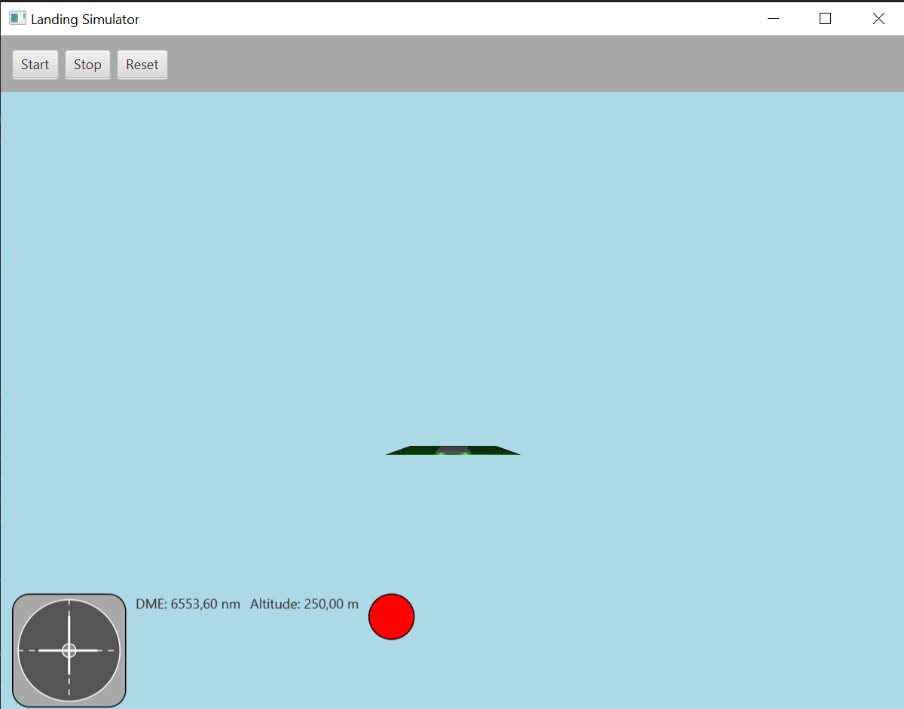
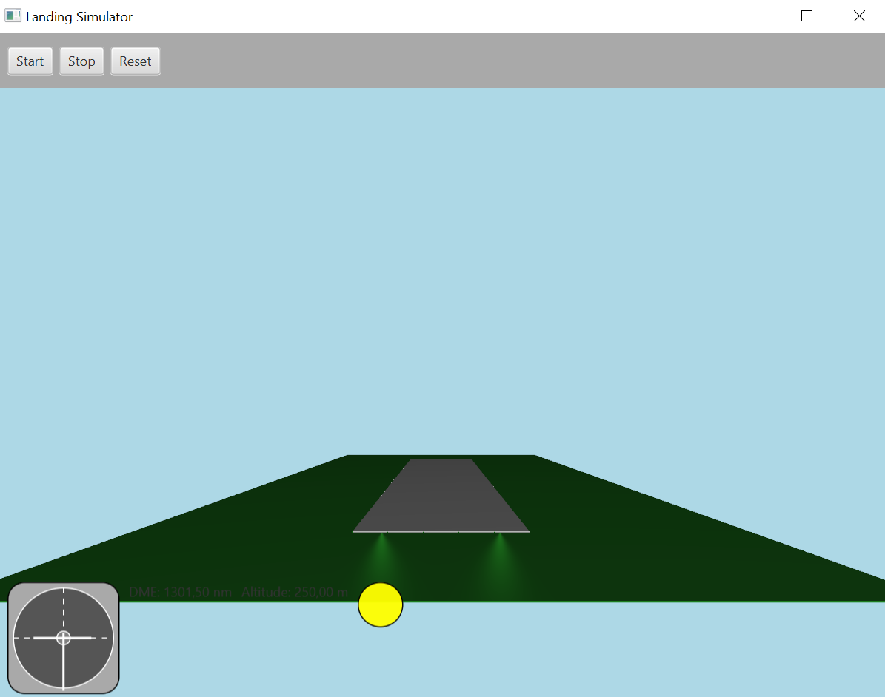
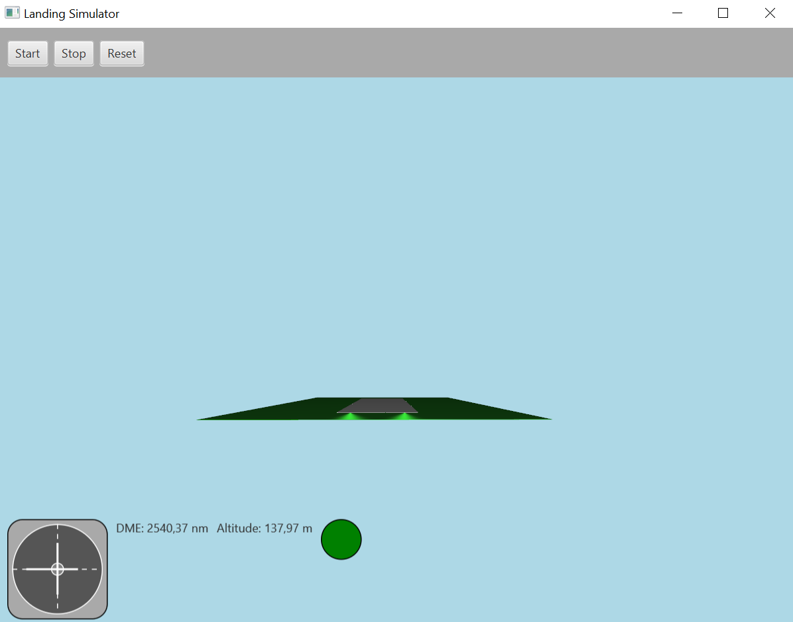
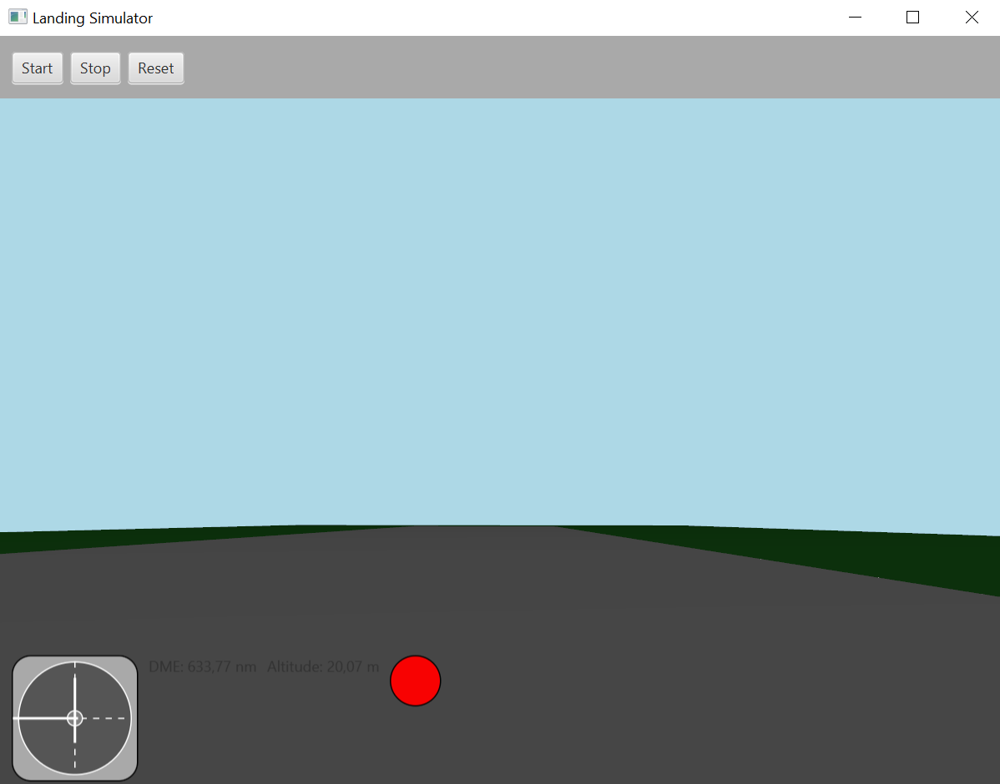

# Flight Landing Simulator



## Overview

Flight Landing Simulator is a 3D flight landing simulation built with JavaFX. The simulator allows users to control an aircraft and experience realistic landing procedures, including navigation aids such as ILS (Instrument Landing System) and PAPI (Precision Approach Path Indicator) lights. The project demonstrates advanced 3D mathematics, real-time feedback, and a modern user interface.

## Features

- 3D aircraft movement and realistic physics
- Full implementation of ILS and PAPI navigation aids
- Detailed runway and approach modeling
- Real-time feedback on approach path and landing quality
- Responsive and intuitive user interface
- Comprehensive logging and error handling

## Screenshots

| Aircraft Approach | ILS Visualization | Runway View | PAPI Lights |
|------------------|------------------|-------------|-------------|
|  |  |  |  |

## Technical Stack

- **Language:** Java 17
- **UI Framework:** JavaFX 17
- **Build Tool:** Maven
- **Logging:** SLF4J & Logback
- **Architecture:** MVC (Model-View-Controller)

## Getting Started

1. Clone the repository:
   ```bash
   git clone https://github.com/yourusername/flight-landing-simulator.git
   ```
2. Build the project with Maven:
   ```bash
   mvn clean install
   ```
3. Run the application:
   ```bash
   mvn javafx:run
   ```

## Assets

All images and models used in this project are located in the `assets/` directory.

## License

This project is licensed under the MIT License.